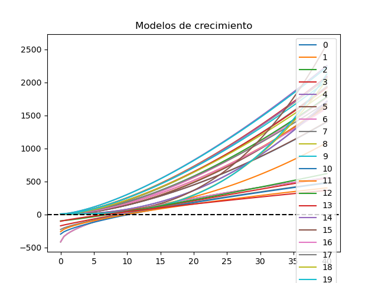
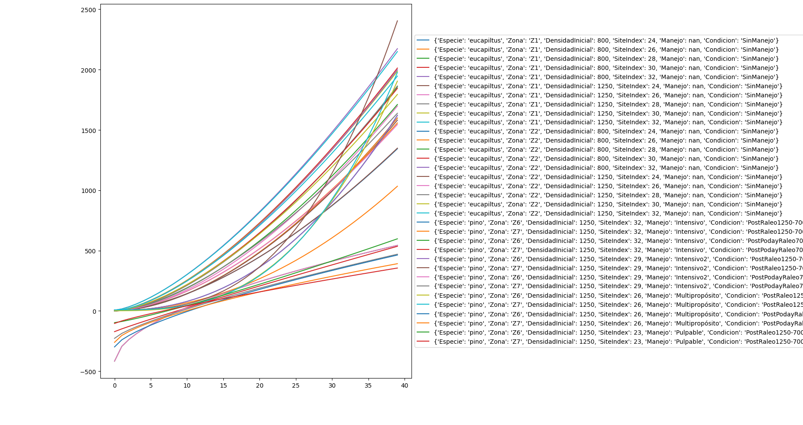

# forest growth generator

### quick start
1. text edit `config.toml` for the desired parameters
2. run: `python -c "import simulator; rodales = simulator.generate(); simulator.write(rodales)"`

### more options
see `simulator.py`

### requirements
numpy
#### optionals
matplotlib
scipy
sympy

