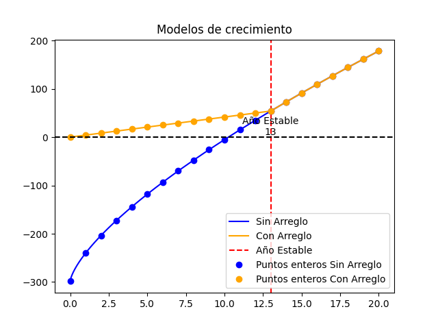

# STAND GROWTH SIMULATOR
### SIMULADOR DE CRECIMIENTO EN RODALES

This repo contains a timber plantation growth simulator, for stands generating various management policy options. It's entirely made in python with simple dependencies.

The code is based on the paper: . By: Alejandro Miranda, Blas Mola and Víctor Hinojosa

For 34 types of eucalyptus and pinus plantations in the central-south of Chile, a statistical study fitted the power law found in `tabla.csv`.
The result file of the statistical study includes the following information for each of the 34 combinations of species and rotation type: 

|Attribute|Translation description|
|--|--|
|id| model identification representing the type of stand|
|Next| id of the model the stand would turn into if it is thinned. When `null`, the stand can't be thinned (eucalyptus for example).|
|Prev|Previous, opposite of next; the id of the stand before it would've been thinned.|
|Especie|species of the stand (pinus or eucalyptus).|
|Zona de crecimiento|Zone of Chile where the stand is growing. It  depends on the species of the stand (pinus and eucalyptus have diferent zones).|
|Edad del rodal|Age of the stand.|
|Densidad Inicial (n init)|Initial density of the stand for ha.|
|Índice de Sitio (SI)|Site index, mean height of the stands of 10 years.|
|Manejo aplicado al rodal|management of the stand (Pulpable, Multiproposito, Intensivo 1, Intensivo 2 or Sin manejo).|
|Condición|Condition of the stand. It can be "posterior Raleo" (post thinning), "posterior a poda y raleo" (post thinning and prunning)|
|$\alpha$,$\beta$, $\gamma$|coeficents for the biomass model|
|stableyear|year when the formula begins to yield stable results (it depends on the type of pinus).|


The managment of the stand, can be anyone of the next:

• ***Pulpable***: pulpwood, case where the stand thinn for disposal.

• ***Multipropósito***: multiporpuse, when the stand is thinned and pruned 2 times.

• ***Intensivo 1***: Intensive 1, when the stand pruned 3 times and thinned 2 times.

• ***Intensivo 2***: Intensive 2, like intensive 1, but with a different site cuality.

• ***Sin manejo***: wihtout any managment.|

1. The equation to get biomass for a stand of age t is:
$$
biomass(t) = \alpha \cdot t^\beta + \gamma
$$

2. To extrapolate to earlier years; due to the formula yielding negative values (for a few types of pinus). A linear adjustment was made:

$$
\text{biomass}(t) = 
\begin{cases} 
\left(\alpha \cdot \text{stableyear}^\beta + \gamma \right) \cdot \frac{t}{\text{stableyear}} & \text{if } t < \text{stableyear} \\
\alpha \cdot t^\beta + \gamma & \text{if } t >= \text{stableyear}
\end{cases}
$$

_Stable year is the year when the formula begins to yield stable results (it depends on the type of pinus)._

3. A template for generating a timber plantation and different management policies was made (config.toml)

    ```toml
    horizon = 10 # number of years to generate
   

    [random]
    # random number generator seed: omit or comment for different results each run
    seed = 5
    # `low` (inclusive) to `high` (exclusive)
    # n, n+1 for getting a single value: n
    # see np.random.randint
    ages = [1, 18] # min, max age of generated stands
    has = [5, 15] #  min, max hectares of generated stands
    stands = 36 # number of stands to generate, choosing one model at random

    # ranges: start, stop, step
    # n, n+1 for getting a single value range: [n]
    # see np.arange
    [eucalyptus]
    harvest = [10, 20, 3] # for each Eucalyptus stand, generate different biomass histories harvesting in the year 10, 13, 16 and 19 (4 histories) 
    
    [pino] #pinus
    thinning = [6, 11, 2] # thinning policies in the years 6, 8, 10.
    harvest = [18, 29, 3] # harvesting policies in the years 18, 21, 24, ... (every 3 years)
    # all feasible histories combining thinning and harvesting policies will be generated
    min_thinning = 6 #lower bound to tree thinning actions
    ``` 

1. For a real instance, the numbers of stands and its characteristics can be passed instead of generated at random. For this a `.csv` or `.shp` file is used, the data must include the following fields:

- **fid**: Stand or feature ID of the polygon in the  `.csv` or `.shp` file  
- **mid**: Unique identifier for the model to which the stand belongs, must match the `id` field in `tabla.csv`
- **age**: Age of the stand  
- **hectare (ha)**: Area in hectares  

See `auxiliary.py` for GIS extraction or creation of this attributes table `bosque_data.csv` using the methods `get_data` and `create_forest`.

### quick start

0. Clone, download or just get `simulator.py`, `tabla.csv` and `config.toml`
1. Have numpy installed (and toml if python version < 3.11)
2. Console run: `python simulator.py` to generate at random or `python simulator.py -f bosque_data.csv` to use a real instance
3. Scripting/Interactive use:
    ```python
    import simulator
    rodales = simulator.main(['-s']) # rodales is a list of dictionaries each representing a stand with its biomass history, harvesting and thinning policies
    ```
4. Done! The output is a list of several csv files: biomass.csv, events.csv, vendible.csv, codigo_kitral.csv & bosque.csv

### more info

1. `python simulator.py --help`
2. See `example` folder
3. Read  `__doc__`s
4. Read `config.toml`
5. Read Methodoly section of 

### models plots


### example of new formula of biomass in model whith id 30
  
